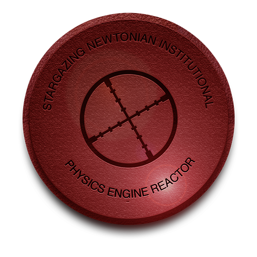

#
S.N.I.P.E.R.

## About
**S**targazing **N**ewtonian **I**nstitutional **P**hysics **E**ngine **R**eactor, also known as S.N.I.P.E.R., is a basic 2D physics engine written in C#.

## Project build with
Visual Studio Ultimate 2012  
on Windows 8.1

